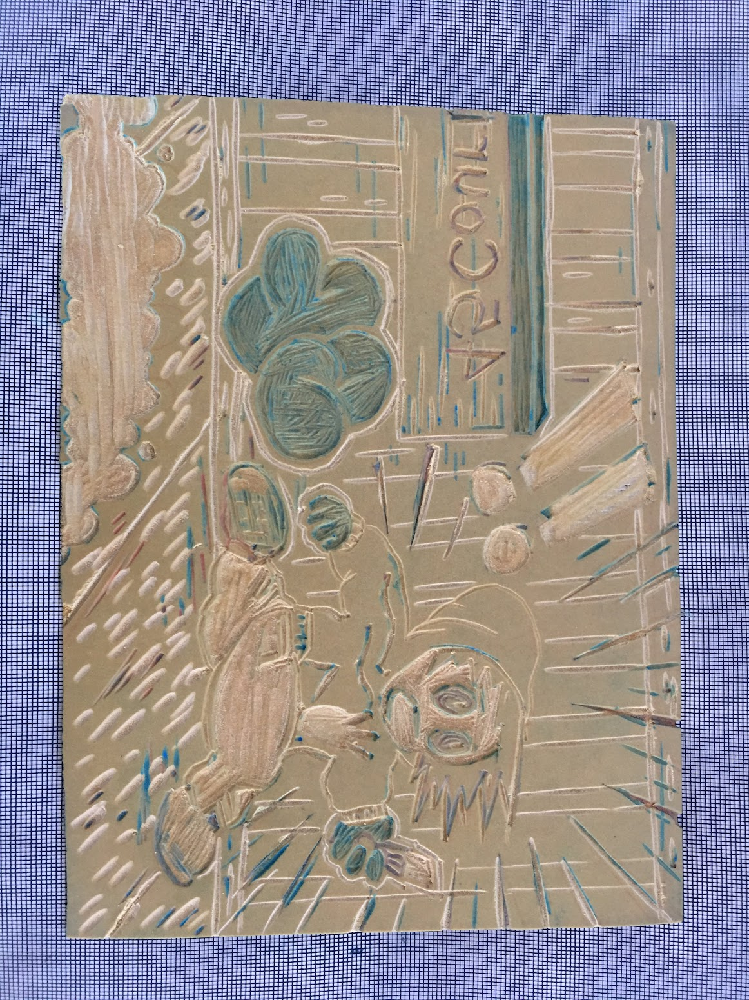

#process
&nbsp;&nbsp;
&nbsp;&nbsp;
&nbsp;&nbsp;
 
## I Ran...
**2019** 
Material: Acid free 135lb paper  

*dimensions: 30.48cm(H) x 45.72cm(W)  |  12"(H) x 18"(W)*  
*Original Three-Colour Process linocut.*   
*Limited edition. Eight Prints Produced*  
*Handmade & hand printed.*  
*Image courtesy of the artist.*  
